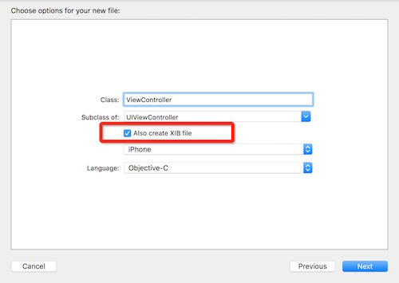
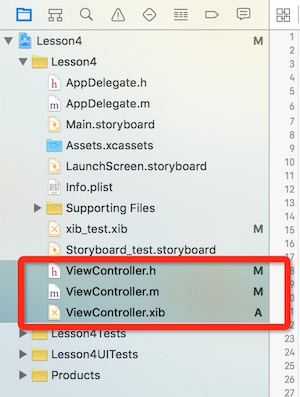
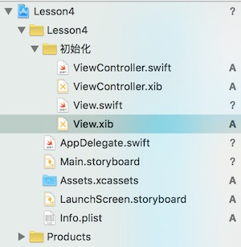
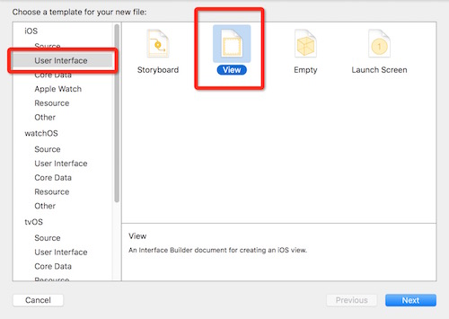

# xib-storyboard-note
xib和storyboard的用法笔记

##介绍
到现在，IOS的界面开发主要分为3个流派：一是使用代码手写UI及布局；二是使用Interface Builder（xib）组织View和ViewController；最后是通过storyboard来将几个viewcontroller组织起来构建一个流程的UI。

###手写代码
这种方式比较适合于开发公共控件的时候，它可以实现任何复杂的UI效果。它还具有重用的特性，可以被任何子类继承，别的开发者在使用的时候会方便不少。

###xib
xib的存在，最初是为了将MCV中的V更好的被人理解，一个View可以通过xib来设计，通过资源文件加载的方式被加载出来。

###storyBoard
storyboard是将一组MVC的结构组织到了一起，形成了一定的流程。在storyboard中不仅仅可以看到UI的布局方式，并且还可以看到这几组viewcontroler之间的关系。

不过storyboard在多人协作方便确实也存在问题，因为所有的UI都定义在一个文件中，多人修改会频繁造成冲突。
还有就是在里面设计的UI布局不能复用，在另外的Viewcontroller中复用只能复制过去，维护起来是个噩梦。

##初始化

###xib

通过创建viewcontroller可以勾选创建一个与此viewcontroller对应的xib视图。

这样在程序初始化viewcontroller的view的时候会从这个xib加载UI。

还有一些用Xib布局的view我们希望能够在其它地方复用，可以单独创建一个xib对应一个view。

首先创建一个类叫View继承自UIView

然后创建一个xib文件名叫View

接着可以看到在xib文件中有个空白的View，这个时候这个view是一个UIView的对象而不是我们刚刚创建的View类的实例。

我们需要将它配置成我们刚才创建的View类

这样我们通过这个xib创建的实例就是View类的实例了。

我们在View.swift中添加以下初始化代码来通过Xib创建View实例

	class func createWithNib() -> View {
        return NSBundle.mainBundle().loadNibNamed("View", owner: self, options: nil).first as! View
    }
    
nsbundle 可以加载程序中的bundle资源文件，用这种方式可以加载xib中的View

NSBundle.mainBundle()是获取程序的主资源包，加载资源文件的地方。

loadNibNamed这个方法是加载一个Nib（xib）文件，第一个参数是指xib文件的名字。它返回一组view对象，这一组对象是xib文件中描述多个view UI。

###storyboard

##简单操作

###IBOutlet

##autolayout

##classSize

##UIStackView

##高级用法

###属性配置